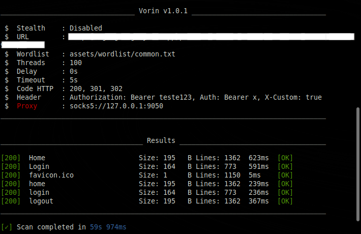

# Vorin - Web Directory & Admin Scanner

**Vorin** is a web directory and admin path scanner tool written in Go. It's built for speed, simplicity, and clean output. Inspired by tools like Gobuster and FFUF, but with its own unique style.

  - Search and find hidden directories.
  - Use stealth mode to attack your friend's project without being discovered.
  - UIless mode for those in a hurry using silence.
  - Live mode to make sure my tool actually works.
  - Use a proxy so your little friend doesn't find out about you (do you really need to hide so much from him?)

# Statistics and weird stuff

[](https://github.com/JuaanReis/vorin) &nbsp;
[](https://github.com/JuaanReis/vorin/pulls) &nbsp;
[](https://github.com/JuaanReis/vorin/commits/main) &nbsp;
[](https://golang.org/)
[](LICENSE) &nbsp;
[](https://www.youtube.com/watch?v=dQw4w9WgXcQ)


## Features

- Fast scanning with multithreading
- Custom wordlist support
- Detects common directories, admin panels, and sensitive files
- Clean and colorful terminal output
- Easy to compile and use on any OS

## Installation

 To use the latest version of vorin use the command below to copy the repository and compile

```bash
git clone https://github.com/JuaanReis/vorin.git
cd vorin
go build -o vorin
```
`The easiest and most error-free way, I hope`

or

```bash
go install github.com/JuaanReis/vorin@latest
```
` You just need to have Go installed`

or

```bash
curl -s https://raw.githubusercontent.com/JuaanReis/vorin/cmd/install.sh | bash
```
`If you want to download or update vorin`

*Vorin depends on Go version 1.22.3 or newer*<br>
> *If you don't have go installed, download it here -> [Go](https://golang.org/dl/)*

## Usage

`This is a basic example of a scan`

```bash
./vorin -u http://example.com/Fuzz -w path/to/wordlist.txt -t 50 -d 1-3 -H "X-Debug: true" -H "Authorization: Bearer teste123" -timeout 5 -s 200,301,302 -proxy socks5://127.0.0.1:9050
```

### Parameters

| Flag       | Description                                                  | Default                        | Example                                      |
|------------|--------------------------------------------------------------|--------------------------------|----------------------------------------------|
| `-u`       | Target URL (must contain `Fuzz`)                             | ""                             | `-u https://site.com/Fuzz`                   |
| `-w`       | Path to wordlist                                             | `assets/wordlist/common.txt`   | `-w mylist.txt`                              |
| `-t`       | Number of concurrent threads                                 | 50                             | `-t 100`                                     |
| `-d`       | Random delay between requests (e.g. 1-5)                     | `0s`                           | `-d 1-3`                                     |
| `-timeout` | Connection timeout                                           | `5s`                           | `-timeout 10`                                |
| `-H`       | Custom headers (repeatable)                                  | None                           | `-H "X-Test: true"`                          |
| `-s`       | Valid status codes (comma-separated)                         | `200,301,302`                  | `-s 200,403`                                 |
| `-proxy`   | Proxy URL (supports HTTP/SOCKS5)                             | None                           | `-proxy socks5://127.0.0.1:9050`             |
| `-silence` | Hide progress/output until finished                          | `false`                        | `-silence`                                   |
| `-live`    | Print results immediately when found                         | `false`                        | `-live`                                      |
| `-stealth` | Enables stealth mode (random headers, delay, etc)           | `false`                        | `-stealth`                                   |
| `-o`       | Path to save results as JSON                                 | None                           | `-o results.json`                            |


## Example

Below is a real example of the tool running in a test environment, showing detection of hidden directories and sensitive files:



> All tests were performed in a safe and controlled environment, without affecting any real systems.

>Please act responsibly — this tool is not a green light for illegal testing.

## Wordlist

You can use any custom wordlist. It's recommended to start with a small list and scale up as needed.

Example wordlist:

```
admin
admin/login
.git
.htaccess
phpinfo.php
uploads
includes
```

##  Output

You can save the scan results using the `-o` flag:

```bash
./vorin -u http://example.com/Fuzz -o results.json
```
*The path must be passed to the flag*

`JSON is formatted and can be saved anywhere.`

**Example**

```
[
  {
    "status": 200,
    "path": "admin",
    "title": "login page",
    "size": 215,
    "lines": 1234,
    "time_ms": 421,
    "label": "[OK]"
  }
]
```

## Security & Responsibility

This tool is intended strictly for educational, ethical hacking, and professional security testing in authorized environments.

Use it responsibly.
  Any misuse is entirely your responsibility.
I (the author) am not liable for any damage, legal consequences, or problems caused by improper or unauthorized use of this tool. Know the law and play by the rules.
## Security

This tool is intended for **educational and professional testing purposes only**. Unauthorized use against systems may be illegal and is your responsibility.

## License

> The project is open for any attribution and any use, but you should leave it open too.<br><br>
*just don't use it to attack your friend's website*

GPL License. See the [LICENSE](LICENSE) file for more details.

## Contributing

Feel free to open issues or pull requests.
If you want to suggest payloads, improvements, or report bugs, go ahead!

---

Developed with ❤️ by [Juan](https://github.com/JuaanReis)
Follow me on GitHub for more tools.

## Useful Links

- [Wordlists (SecLists)](https://github.com/danielmiessler/SecLists)
- [FFUF (Inspiration)](https://github.com/ffuf/ffuf)
- [Gobuster (Inspiration)](https://github.com/OJ/gobuster)
