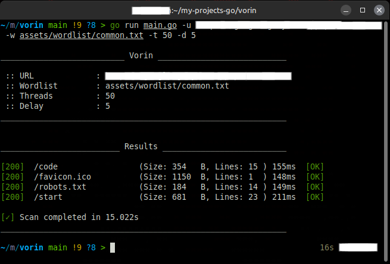

# Vorin - Web Directory & Admin Scanner

**Vorin** is a web directory and admin path scanner tool written in Go. It's built for speed, simplicity, and clean output. Inspired by tools like Gobuster and FFUF, but with its own unique style.

## Features

- Fast scanning with multithreading
- Custom wordlist support
- Detects common directories, admin panels, and sensitive files
- Clean and colorful terminal output
- Easy to compile and use on any OS

## Installation

```bash
git clone https://github.com/youruser/vorin.git
cd vorin
go build -o vorin
```

## Usage

```bash
./vorin -u http://example.com -w wordlist.txt -t 50
```

### Parameters

| Flag     | Description                               |
|----------|-------------------------------------------|
| `-u`     | Target URL                                |
| `-w`     | Path to wordlist                          |
| `-t`     | Number of threads (default: 50)           |

## Example

Below is a real example of the tool running in a test environment (like `testphp.vulnweb.com`), showing detection of hidden directories and sensitive files:



> All tests were performed in a safe and controlled environment, without affecting any real systems.

## Wordlist

You can use any custom wordlist. It's recommended to start with a small list and scale up as needed.

Example wordlist:

```
admin
admin/login
.git
.htaccess
phpinfo.php
uploads
includes
```

## Security & Responsibility

This tool is intended strictly for educational, ethical hacking, and professional security testing in authorized environments.

⚠️ Use it responsibly.
⚠️ Any misuse is entirely your responsibility.
I (the author) am not liable for any damage, legal consequences, or problems caused by improper or unauthorized use of this tool. Know the law and play by the rules.
## Security

This tool is intended for **educational and professional testing purposes only**. Unauthorized use against systems may be illegal and is your responsibility.

## License

GPL License. See the `LICENSE` file for more details.
