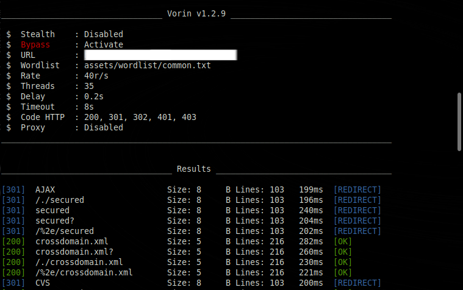

# Vorin - Web Directory & Admin Scanner

**Vorin** is a web directory and admin path scanner tool written in Go. It's built for speed, simplicity, and clean output. Inspired by tools like Gobuster and FFUF, but with its own unique style.

  - Search and find hidden directories.
  - Use stealth mode for silent reconnaissance... but don't do it on your little friend's project.
  - UIless mode for those in a hurry using silence.
  - Live mode to make sure my tool actually works.
  - Use a proxy so your little friend doesn't find out about your tests (do you really need to hide so much from him?)

## Table of Contents

- [Features](#features)
- [Installation](#installation)
- [Usage](#usage)
- [How it works](#how-it-works)
- [Structure](#project-structure)
- [Wordlist](#wordlist)
- [Output](#output)
- [Stealth Mode](#stealth-mode)
- [Security](#security--responsibility)
- [License](#license)
- [Contributing](#contributing)
- [Useful Links](#useful-links)

> *The most used link is definitely the one on how to install*

# Statistics and weird stuff

[](https://github.com/JuaanReis/vorin) &nbsp;
[](https://github.com/JuaanReis/vorin/pulls) &nbsp;
[](https://github.com/JuaanReis/vorin/commits/main) &nbsp;
[](https://golang.org/)
[](LICENSE) &nbsp;
[](https://www.youtube.com/watch?v=dQw4w9WgXcQ) &nbsp;
[](https://www.youtube.com/watch?v=QwLvrnlfdNo)

## Features

- Fast scanning with multithreading
- Custom wordlist support
- Detects common directories, admin panels, and sensitive files
- Clean and colorful terminal output
- Easy to compile and use on any OS

## Installation

 To use the latest version of vorin use the command below to copy the repository and compile

```bash
git clone https://github.com/JuaanReis/vorin.git
cd vorin
go build -o vorin
```
`The easiest and most error-free way, I hope`

or

```bash
go install github.com/JuaanReis/vorin@latest
```
` You just need to have Go installed`

or

```bash
curl -s https://raw.githubusercontent.com/JuaanReis/vorin/cmd/install.sh | bash
```
`If you want to download or update vorin`

*Vorin depends on Go version 1.22.3 or newer*<br>
> *If you don't have go installed, download it here -> [Go](https://golang.org/dl/)*

⚠️ *If you get any permission denied error on Linux, try:*

```bash
chmod +x vorin
```

## Usage

`This is a basic example of a scan`

```bash
./vorin -u http://example.com/Fuzz -w path/to/wordlist.txt -t 50 -rate 35 -d 0.6-0.7 -H "X-Debug: true" -H "Authorization: Bearer teste123" -shuffle -timeout 5 -s 200,301,302,403 -proxy socks5://127.0.0.1:9050 -ext php
```

## How it works

*Vorin uses Go's native concurrency to spawn multiple workers that:*
- Replace the `Fuzz` keyword in the URL
- Send HTTP GET requests
- Analyze the response (status, size, title, etc.) and compare it to a random path (it really is random)
- Display results with clean formatting (with optional silent or active mode) <br>
> *I really tried to explain*

## Project Structure

```
vorin/
├── assets/ # Wordlists, banners, and screenshots
├── cmd/ # bash codes (shell for installation)
├── config/ # (default customization files)
├── internal/ # Core scanner logic (requests, handlers)
├── pkg/ (files you definitely won't want to redo)
├── main.go # Entry point
└── README.md # You're here (I didn't even need to write this)
```
> *Making the structure was easier than writing it*

### Parameters

| Flag       | Description                                                  | Default                        | Example                                      |
|------------|--------------------------------------------------------------|--------------------------------|----------------------------------------------|
| `-u`       | Target URL (must contain `Fuzz`)                             | ""                             | `-u https://site.com/Fuzz`                   |
| `-w`       | Path to wordlist                                             | `assets/wordlist/common.txt`   | `-w mylist.txt`                              |
| `-t`       | Number of concurrent threads                                 | `50`                             | `-t 100`                                     |
| `-d`       | Random delay between requests (e.g. 1-5)                     | `0.1s-0.2s`                           | `-d 1-3`                                     |
| `-timeout` | Connection timeout                                           | `5s`                           | `-timeout 10`                                |
| `-rate`    |  Maximum number of requests per second (RPS). Set 0 to disable rate limiting | `20r/s`        |  `-rate 45`   |
| `-H`       | Custom headers (repeatable)                                  | None                           | `-H "X-Test: true"`                          |
|  `-random-agent` | uses a random user agent per request  | false    |   `-random-agent`  |
| `-s`       | Valid status codes (comma-separated)                         | `200,301,302,401,403`                  | `-s 200,403`                                 |
| `-proxy`   | Proxy URL (supports HTTP/SOCKS5)                             | None                           | `-proxy socks5://127.0.0.1:9050`             |
| `-bypass`  |  Activates bypass techniques  | `false`     | `-bypass` |
| `-ext`     |  Additional extensions, separated by commas (e.g. .php, .bak) | None      | `-ext php,bak,txt,tar.gz`  |
| `-silence` | Hide progress/output until finished                          | `false`                        | `-silence`                                   |
| `-live`    | Print results immediately when found                         | `false`                        | `-live`                                      |
| `-stealth` | Enables stealth mode (random headers, delay, etc)           | `false`                        | `-stealth`                                   |
| `-o`       | Path to save results as JSON                                 | None                           | `-o results.json`                            |
| `-filter-size`  | filter pages by size | 0      |  `-filter-size  2`  |
| `-filter-line` | filters pages by number of lines |  0 |   `-filter-line 1`  |
|  `-filter-title` | filters page by title  | ""  | `-filter-title "404 Not Found"` |
| `-shuffle`  | shuffle the wordlist  | `false`    |  `-shuffle`    |


## Examples

Below is a real example of the tool running in a test environment, showing detection of hidden directories and sensitive files:

> Below a proxy was also used (must be activated manually)


> Below is a scan with stealth mode


Stealth mode comes with the following settings:
```
{
  "threads": 30,
  "rate": 15r/s,
  "delay": 0.2s-0.2s,
  "timeout": 7s,
  "header": "random",
  "proxy": "needs to be activated manually"
}
```

> Below is a scan with bypass (it is clearly slower)



*Not all the results of this scan appeared because many paths were discovered*

The bypass configuration is as follows:
```
{
  "threads": 30,
  "rate": 15r/s,
  "delay": 0.2s-0.3s,
  "header" random but different from stealth mode,
  "proxy" still has to be activated manually (how many times will I have to repeat this?),
}
```

> Below is a picture of a scan with all other modes active, it was not finished due to laziness. (*time marked by the red line*)


*I really thought it would take longer, if you can do this test, put the total time here in the readme*

> All tests were performed in a safe and controlled environment, without affecting any real systems.<br>
> *Please act responsibly — this tool is not a green light for illegal testing.*

## Wordlist

You can use any custom wordlist. It's recommended to start with a small list and scale up as needed.

Example wordlist:

```
admin
admin/login
.git
.htaccess
phpinfo.php
uploads
includes
```

> *I think it's better to get something ready-made than to make it. (I'm lazy)*

##  Output

You can save the scan results using the `-o` flag:

```bash
./vorin -u http://example.com/Fuzz -o results.json
```
*The path must be passed to the flag*

`JSON is formatted and can be saved anywhere.`

**Example**

```
[
  {
    "status": 200,
    "path": "admin",
    "title": "login page",
    "size": 215,
    "lines": 1234,
    "time_ms": 421,
    "label": "[OK]"
  }
]
```
---
You can use the -silent flag for no output other than the prints at the end, and it has a cool snake animation

Example:
```
[Vorin] Running ⠼
```
*I would wear this to school*
> I know it doesn't look good with code, use vorin just to see the animation (I recommend it)
## Security & Responsibility

This tool is intended strictly for educational purposes, ethical hacking and professional security testing in authorized environments.

Please use it responsibly.
Any misuse is your sole responsibility.

I (the author) am not responsible for any damages, legal consequences or problems caused by improper or unauthorized use of this tool. Know the law and follow the rules.

> *Especially since I don't have money to pay a lawyer.*

## License

> The project is open for any attribution and any use, but you should leave it open too.<br><br>
*just don't use it to attack your friend's website*

GPL License. See the [LICENSE](LICENSE) file for more details.

## Contributing

Feel free to open issues or pull requests.
If you want to suggest payloads, improvements, or report bugs, go ahead!

---

Developed with ❤️ by [Juan](https://github.com/JuaanReis)
Follow me on GitHub for more tools.

## Useful Links

- [Wordlists (SecLists)](https://github.com/danielmiessler/SecLists)
- [FFUF (Inspiration)](https://github.com/ffuf/ffuf)
- [Gobuster (Inspiration)](https://github.com/OJ/gobuster)